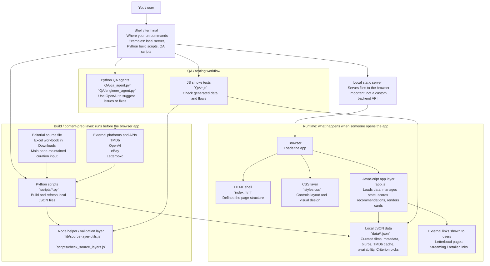

# System Diagram

This is a rough map of how the current app fits together.

The big picture: this is mostly a static browser app. The "real app" runs in the browser, and Python scripts are used offline to prepare the JSON data that the browser reads.

## What each layer means

- Shell / terminal: this is your command-line control panel. You use it to start a local server, run Python scripts, and run QA checks.
- Local static server: this just makes the files available in the browser. It is not doing recommendation logic itself.
- HTML shell: [`index.html`](/Users/elliott/Documents/New project/index.html) is the frame of the page.
- CSS layer: [`styles.css`](/Users/elliott/Documents/New project/styles.css) makes it look like a product instead of plain HTML.
- JavaScript app layer: [`app.js`](/Users/elliott/Documents/New project/app.js) is the heart of the app at runtime. It fetches JSON, tracks user state, computes recommendations, and updates the screen.
- Local JSON data: the browser reads files from [`data/`](/Users/elliott/Documents/New project/data) instead of calling a real backend API.
- Python layer: the scripts in [`scripts/`](/Users/elliott/Documents/New project/scripts) are your offline content pipeline. They build or refresh the JSON files the browser needs.
- Node helper layer: [`lib/source-layer-utils.js`](/Users/elliott/Documents/New project/lib/source-layer-utils.js) and [`scripts/check_source_layers.js`](/Users/elliott/Documents/New project/scripts/check_source_layers.js) help validate the source-layer graph data.
- QA layer: the [`QA/`](/Users/elliott/Documents/New project/QA) folder is a separate testing workflow, not part of the user-facing app itself.

## Runtime flow

1. You start a simple local server from the shell.
2. The browser opens the app.
3. [`app.js`](/Users/elliott/Documents/New project/app.js) fetches local JSON files such as:
   - [`data/curated-films.json`](/Users/elliott/Documents/New project/data/curated-films.json)
   - [`data/film-metadata.json`](/Users/elliott/Documents/New project/data/film-metadata.json)
   - [`data/recommendation-blurbs.json`](/Users/elliott/Documents/New project/data/recommendation-blurbs.json)
   - [`data/tmdb-metadata.json`](/Users/elliott/Documents/New project/data/tmdb-metadata.json)
   - [`data/availability.json`](/Users/elliott/Documents/New project/data/availability.json)
4. The user searches for a film or clicks a quick pick.
5. [`app.js`](/Users/elliott/Documents/New project/app.js) builds recommendations using:
   - hand-curated links
   - sample movie attributes
   - TMDb enrichment
   - Criterion Closet picks
   - editorial blurbs
6. The browser renders recommendation cards and outgoing links.

## Build flow

1. Your editorial curation starts in an Excel workbook.
2. Python scripts turn that into local JSON caches.
3. Some scripts also enrich the dataset from outside platforms.
4. The browser app then reads those generated JSON files at runtime.

## Where outside platforms show up

- TMDb: used by [`scripts/build_tmdb_metadata.py`](/Users/elliott/Documents/New project/scripts/build_tmdb_metadata.py) and [`scripts/build_availability_data.py`](/Users/elliott/Documents/New project/scripts/build_availability_data.py) for posters, metadata, and watch-provider data.
- OpenAI: used by [`scripts/build_recommendation_blurbs.py`](/Users/elliott/Documents/New project/scripts/build_recommendation_blurbs.py), [`QA/qa_agent.py`](/Users/elliott/Documents/New project/QA/qa_agent.py), and [`QA/engineer_agent.py`](/Users/elliott/Documents/New project/QA/engineer_agent.py).
- Letterboxd: used in two ways:
  - metadata scraping/enrichment in [`scripts/build_film_metadata.py`](/Users/elliott/Documents/New project/scripts/build_film_metadata.py)
  - user-facing outbound links from recommendation cards in [`app.js`](/Users/elliott/Documents/New project/app.js)
- eBay: used by [`scripts/build_availability_data.py`](/Users/elliott/Documents/New project/scripts/build_availability_data.py) for physical media listings.
- Criterion / BFI / HMV: used as recommendation context or outbound retailer links inside the data pipeline and app experience.

## The simplest mental model

If you want the shortest possible explanation, it is this:

- Browser app: `index.html` + `styles.css` + `app.js`
- Data store: local JSON files in `data/`
- Content pipeline: Python scripts in `scripts/`
- Validation / smoke tests: `QA/` plus a small Node helper layer
- No real backend API yet
- No database yet
